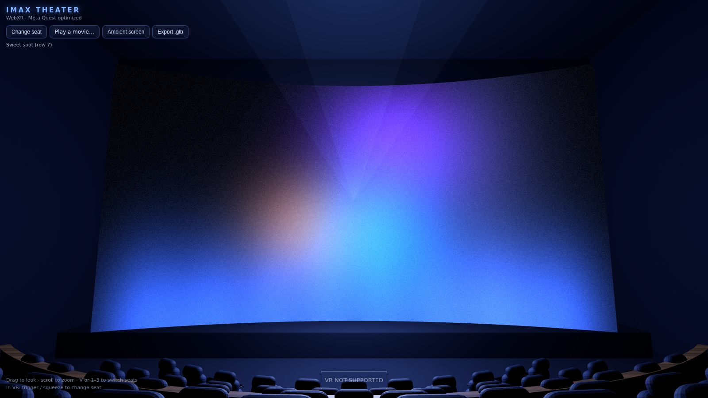
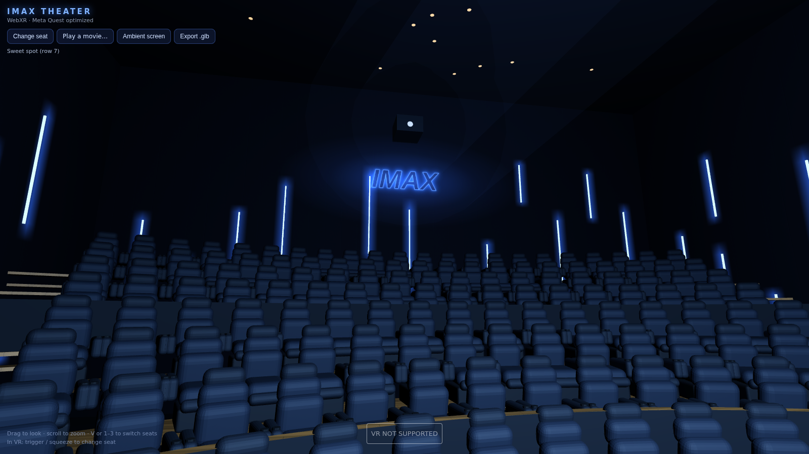

# IMAX-Style Movie Theater — 3D Model (WebXR / Meta Quest)

A photoreal-styled IMAX auditorium built procedurally with Three.js, modeled
after reference photos: 10 curved tiers of plush recliners (163 seats), warm
oak aisle flooring with blue step lights, vertical LED strip walls, a glowing
IMAX logotype, stage uplights, a projection beam, and a giant 19.5 m curved
screen playing an ambient "trailer" shader — or your own video file.




## Run it

Any static file server works (ES modules need http, not file://):

```bash
cd theater
python3 -m http.server 8080
# open http://localhost:8080
```

- **Desktop:** drag to look, scroll to zoom, `V` or `1–3` to switch seats.
- **Meta Quest:** open the URL in the Quest browser (serve over HTTPS or use
  `adb reverse tcp:8080 tcp:8080`), then press **Enter VR**. Trigger or
  squeeze cycles between seats.
- **Play a movie:** click *Play a movie…* and pick any local video file — it
  plays on the screen with correct color. *Ambient screen* switches back.

## Quest performance notes

Built to hold 72–90 fps on Quest hardware:

- All seats are a single `InstancedMesh` (one draw call); every other static
  material is merged into one mesh per material (~20 draw calls total).
- Only 4 real lights; every LED, step light, logo and glow is emissive/unlit
  geometry with additive glow sprites — no shadow maps, no post-processing.
- All textures are generated procedurally at load (no downloads), and
  strongest fixed foveation is enabled in XR.

## The model file

`imax-theater.glb` (2.4 MB) is a standalone export of the whole auditorium —
drop it into Blender, Unity, Unreal, or any glTF viewer. Seats are nodes
sharing one mesh, so the file stays small. The animated screen exports as an
emissive panel. Re-export any time with the *Export .glb* button.

## Files

```
theater/
├── index.html          entry point + UI
├── imax-theater.glb    exported 3D model (share this!)
├── js/
│   ├── main.js         renderer, WebXR, controls, video, UI
│   ├── theater.js      auditorium construction + screen shader
│   ├── seat.js         recliner seat geometry
│   ├── textures.js     procedural textures (wood, leather, LED glows…)
│   └── export.js       GLB exporter
├── previews/           rendered screenshots
└── vendor/             three.js r160 (vendored, no CDN needed)
```
