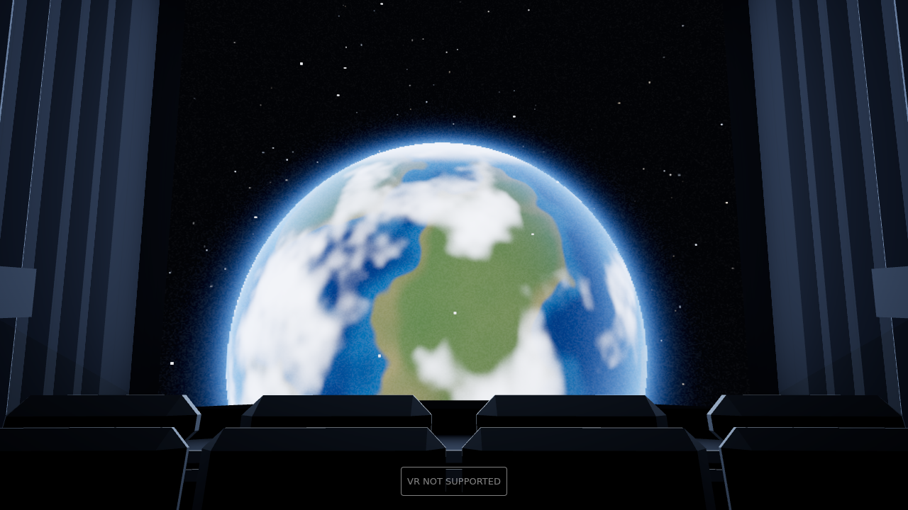
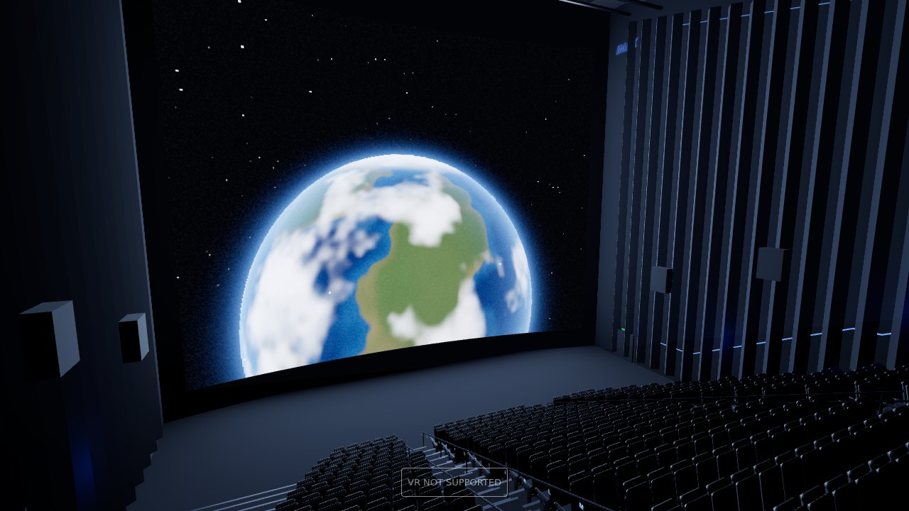
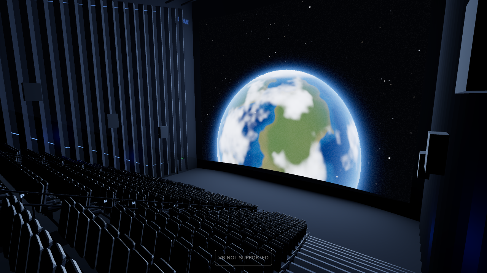

# IMAX 15/70 Auditorium — 3D Model (WebXR, built for Quest 3)

A true large-format IMAX **GT** house, modelled after the real 15-perf/70 mm
venues (AMC Lincoln Square, BFI IMAX, Melbourne, Cinesphere) rather than a
digital multiplex screen. The defining features of an actual 70 mm house are
all here:

- **A 97 × 76 ft screen (29.6 × 23.2 m)** — the dimensions of the AMC Lincoln
  Square screen, the largest 15/70 sheet in the United States. It fills the
  entire 32 m front wall with barely a metre of black surround each side,
  slightly curved on a 62 m radius, inside a velvet masking frame.
- **A 25° seating rake.** Twenty tiers, 0.53 m of rise per row, so the screen
  overfills the field of view from every seat. From the reference seat the
  picture subtends about 50° vertically and 68° horizontally; from row B it is
  116° wide and 67° tall — past the edges of your vision in every direction.
- **An 11 m throw to the front row** — under half a screen height, the
  short-throw geometry that makes IMAX IMAX, with the sill barely above the
  front-row floor.
- **591 fixed high-back seats**, not recliners: upholstered pan and back,
  moulded rear shell, slim shared armrests with recessed cupholders, in three
  blocks split by two stepped aisles. Lincoln Square seats about 590.
- **IMAX-steep aisles** — 27 cm risers, two steps per row, LED step lights,
  metal nosings and handrails on both sides of both aisles.
- Vertical acoustic diffuser fins down the side walls, a coffered acoustic
  ceiling deck sloping from 29 m down to 20 m, surround loudspeaker clusters,
  raking blue cove lighting, illuminated row placards A–T, and the 15/70
  projection booth with its port glass and lens.





## Run it

ES modules need to be served over HTTP, not opened from disk:

```bash
cd theater
python3 -m http.server 8080
# then open http://localhost:8080
```

**On Quest 3** open the URL in the headset browser and press *Enter VR*. Serve
over HTTPS, or tunnel with `adb reverse tcp:8080 tcp:8080`, or enable GitHub
Pages on this repo and open the `theater/` URL directly.

| | |
|---|---|
| **Point and click a seat** | Aim a controller at any seat and pull the trigger to sit there. A reticle previews the seat under your pointer. Grip cycles the preset seats. |
| **Desktop** | Click any seat to sit in it, drag to look, scroll to zoom, `1`–`4` for preset seats, `V` to cycle. |
| **Watch something** | *Load a film…* puts any local video file on the screen — and the house lighting follows it, because the picture is literally the light source. *House reel* returns to the built-in reel. |
| **Tuning** | `?filmres=768` lowers the projection buffer resolution; `?hideui=1` hides the overlay. |

## What is on the screen

The projected picture is generated in a shader and rendered into an off-screen
HDR buffer at **exactly 24 fps** — real film cadence, and it means the cost of
the (fairly heavy) picture shader does not scale with how much of your view the
screen fills. Two reels cross-dissolve every 26 seconds: an orbital Earth pass
with a moving terminator and city lights on the night side, and a deep-field
nebula. Both get gate weave, per-frame emulsion grain, aperture shading and the
occasional piece of dust in the gate.

## How it holds frame rate on Quest 3

The picture does the lighting, which is both how a real IMAX house reads and the
cheapest way to light one:

- **One `RectAreaLight` stands in for the screen.** three.js evaluates it with
  linearly-transformed cosines, so the falloff and the sheen on the handrails
  and nosings are physically correct — no shadow maps, no post-processing, no
  global illumination. Its colour and intensity track the mean of the frame
  currently on screen.
- **Contact shading is baked into vertex colours.** Every structural surface is
  emitted through a quad builder that takes per-corner ambient occlusion, so
  risers, seat wells and wall junctions have real contact darkening without a
  single shadow map.
- **All 591 seats are two instanced draw calls**, and the rest of the house is
  merged into one mesh per material — 16 static meshes and **261k triangles**
  for the entire auditorium. A chamfered-box primitive (44 triangles) does the
  work three's `RoundedBoxGeometry` would spend 300 on.
- Every LED, step light, cove and sign is unlit emissive geometry. Fixed
  foveation is on, MSAA is handled by the headset, and geometry is welded and
  indexed to halve the vertex load.

## The model file

`imax-gt-theater.glb` (2.9 MB) is a standalone export of the whole auditorium —
drop it into Blender, Unity, Unreal or any glTF viewer. Seats become nodes
sharing one mesh so the file stays small, and the live projection surface
exports as an emissive panel. Regenerate it any time with *Export .glb*.

## Files

```
theater/
├── index.html              entry point and overlay
├── imax-gt-theater.glb     exported model
├── js/
│   ├── layout.js           house dimensions, row maths, seat picking
│   ├── auditorium.js       screen, walls, tiers, aisles, booth, lighting
│   ├── seat.js             the cinema seat, split by material
│   ├── mesher.js           quad builder with baked AO, chamfered box, welding
│   ├── textures.js         procedural surfaces — no image assets
│   ├── film.js             the 24 fps projection buffer and its shader
│   ├── export.js           glTF export
│   └── main.js             renderer, WebXR, seat selection, video
├── previews/               rendered stills
└── vendor/                 three.js r160, vendored (no CDN needed)
```
